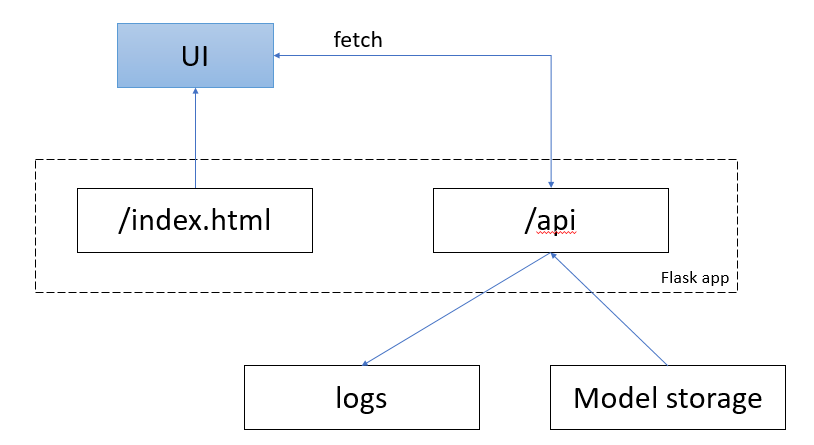

## Housing Price Prediction Model

Тех задание на [Я.диске](https://disk.yandex.ru/d/vDb3HPumZ2xK0w)

### Описание проекта
Проект направлен на создание модели машинного обучения для прогнозирования цен на жилье. Модель использует различные характеристики объектов недвижимости для предсказания их рыночной стоимости.

### Структура проекта
```
housing_price_prediction/
├── data/
│   ├── raw/                # Исходные данные
│   ├── processed/          # Обработанные данные
├── models/                 # Обученные модели
├── notebooks/              # Jupyter notebooks
├── service/                # Сервис предсказания цены на недвижимость
│   ├── templates/          # Шаблоны для веб-приложения
│   └── app.py              # Flask приложение
├── src/                    # Исходный кодAdd commentMore actions
│   ├── lifecycle.py        # Жизненный цикл модели
│   ├── models.py           # Модели машинного обучения
│   └── utils.py            # Вспомогательные функции
├── requirements.txt        # Требования к зависимостям
└── README.md
```

### Архитектура сервиса ПА


### Как запустить
1. Клонируйте репозиторий:
```bash
git clone https://github.com/Valyaevgeorgiy/Predictive-Analytics.git
```

2. Создайте venv и установите зависимости:
```bash
python -m venv venv
venv/Scripts/activate
pip install -r requirements.txt
```

3. Запустите цикл сбора данных и обучения:
```bash
python src/lifecycle.py --parse_data
```

### Признаки
Используемые данные включают следующие характеристики:
* Площадь жилья
* Количество комнат
* Этаж квартиры
* Этажей в доме

### Модель машинного обучения
Применяется `TransformedTargetRegressor`, который логарифмирует целевую переменную (`price`) и затем возвращает предсказания в исходном масштабе через экспоненту. Внутри обёртки — конвейер (`Pipeline`) из `StandardScaler` и регрессора, а подбор лучших гиперпараметров выполняется через `GridSearchCV` (cv=5, scoring=`r2`, многопоточность).  

Перебираются следующие алгоритмы и их настройки:
- **Ridge**: `alpha` ∈ [1e-3 … 1e3]  
- **ElasticNet**: `alpha` ∈ [1e-4 … 1e1], `l1_ratio` ∈ {0.1, 0.5, 0.9}  
- **RandomForestRegressor**: `n_estimators` ∈ {100,200}, `max_depth` ∈ {None,10,20}  
- **ExtraTreesRegressor**: те же параметры деревьев  
- **GradientBoostingRegressor**: `n_estimators` ∈ {100,200}, `learning_rate` ∈ {0.01,0.1}, `max_depth` ∈ {3,5}  
- **HistGradientBoostingRegressor**: `max_iter` ∈ {100,200}, `max_depth` ∈ {None,10,20}

### Данные
Собраны в период с 17.04.2025 по 16.06.2025  
В выборке 1, 2, 3 комнатные квартиры  
Цена до 100 млн, площадь до 100 м2  

Train - 114 квартир  
Test - 29 квартир

### Результаты
После обучения модели  достигаются следующие результаты:
* MAE: 4_736 тыс.р.
* RMSE: 6_612 тыс.р. 
* R² Score train: 0.442
* R² Score test: 0.403

### Использование сервиса предиктивной аналитики в dev mode
1. Запустите сервис с указанием имени модели
```sh
python service/app.py -m model_path
```
2. Веб приложение доступно по ссылке `http://127.0.0.1:5000` 
3. API endpoint доступен  по ссылке `http://127.0.0.1:5000/api/numbers`

### Лицензирование
Этот проект распространяется под лицензией MIT.
Смотрите файл LICENSE для деталей.

### Контакты
Для вопросов и предложений обращайтесь:
* Email: valyaev02gg@gmail.com
* GitHub: @Valyaevgeorgiy
